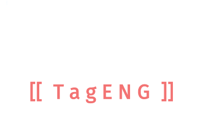

# TagENG 

## Minimal Javascript Template Engine
* * *

### getting started
tagENG is a minimal javascript template engine with powerful data binding

for getting started you need to make your that npm is installed on your machine

the javascript code you wrote must bundle with one of the module bunder such as webpack or rullup so make sure you have one of these tools installed on your machine

for facilitate your work check out the code below just grab it and past it in the dev dependency of your package.json and just run npm install for installing dependencies

       "devDependencies": {
            "babel-loader": "^7.1.1",
            "babel-core": "^6.25.0",
            "babel-preset-es2015": "^6.24.1",
            "webpack": "^3.5.3",
            "webpack-dev-server": "^2.7.1"
        }

* * *

### Prerequisites

* node npm 
* webpack
* babel

###   
* * *
### webpack config file

in your current directory `touch webpack.config.js` or simply just create a javascript file with the name (webpack.config.js)

and put the following in it

    module.exports = {
        devtool: "inline-source-map",
        entry: "./main.js",
        output: {
            filename: "bundle.js"
        },
        resolve: {
            extensions: [".js"],
            alias: {
                fs: "memfs"
            }
        },

        module: {
            loaders: [
                {
                    test: /\.js$/,
                    loader: "babel-loader",
                    query: {
                        presets: ["es2015"]
                    }
                }
            ]
        }
    };

* * *

### installing

after you put the dev dependencies in your package.json

you can also set the scripts property for building and dev purposes by the following :

      "scripts": {
            "test": "echo \"Error: no test specified\" && exit 1",
            "start": "webpack-dev-server",
            "build": "webpack"
        },

after that just install all the dependencies

`npm install`  

then you need to install the TagENG with `npm i tageng`

* * *

Rules of the TagEngine
----------------------

the rules are very simple the tag has only two rules you need to follow

##### first-Rule

for every tag you interested in to bind some value to it you need to set a special data-attribute called `data-t='tag'` like the following :
    
    `
name is [[name]]
`

* * *

#### second-Rule

only values is going to be evaluated if and only if they set between the `[[]]`
* * * 
example `
[[name]]
`

### initializing the app

### 

in your main.js file where you put your javascript

you need to import the tag to your file `import {tagEngine} from 'tageng'` after you import the module you need to create a tagObject using the constructor `const tag = tagEngine()`

after all these thing you just need to write your own code and when you want to bind some data to the html you just need to initialize the model as an object like the following code

    let model = { 
    	name:'foo',
    	skill:'bar'
    }

then you just need to set the model to the tagEngine by writing `tag.setModel(model)`

and finally you need to envoke the render method of the tag after you set the model `tag.render()`

`then you just need to use the model properties in your html in between [[]] symbol like :`

`

    
hi my name is [[name]] and my skill is [[skill]]

`

and when you set the template in your html

you need to bundle you code (main.js) or whatever your main file is depends on the package.json

you can bundle it with webpack . just need to go to your terminal and

    cd current dir 

    webpack

this gives you the bundle.js file depends on what you named the file depends on the config config file of the webpack

* * *

then you just need to attach that bundle.js file to you html like following
 ``
* * *

### see the full example below
* index.html 

`
	
	

		
		<h1 data-t="tag"> and the random number is [[number]]</h1>
		
hi my name is [[name]] and my age is [[age]]

	

`
you after you bundle you js  code just attach it at the bottom of the body

* * *

    
    `import {tagEngine} from 'tageng'

    let tag = tagEngine();

    function randomNumber() { 
    	return Math.random();
    }

    let model = { 
    	number:randomNumber(),

    	name:'keyhan',
    	age:'23'
    }

    tag.setModel(model);
    tag.render();`

* * * 
### LICENCE

[This project is licensed under the MIT License - see the](https://github.com/keeeQ/TagENG/blob/master/LICENSE) for more details
